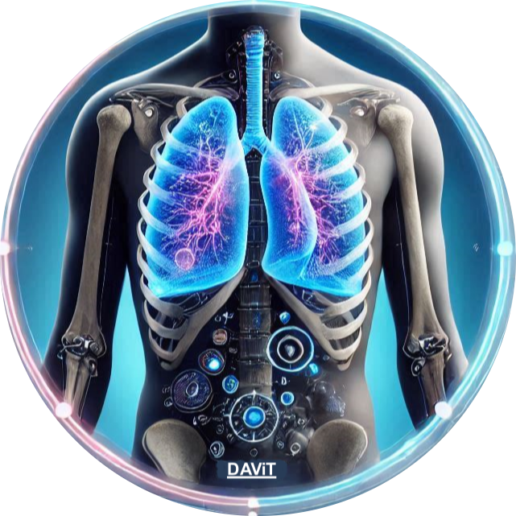
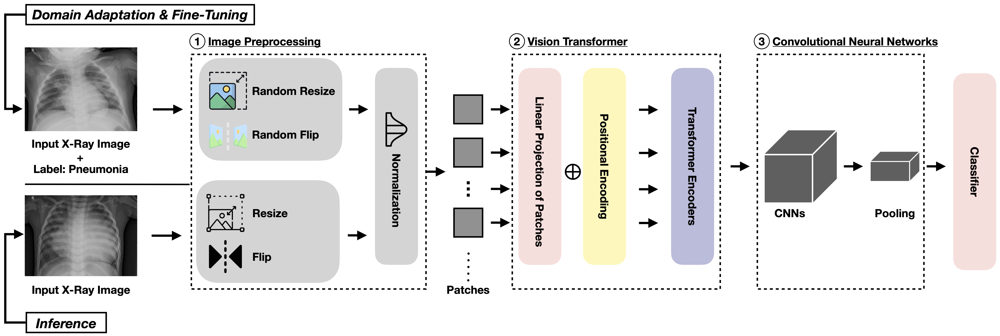

<div align="center">
  
# <br> DAViT: A domain-adapted vision transformer for automated pneumonia detection and explanation using chest X-ray images <br> (Replication Package)

</div>

<p align="center">
  
  </a>
  <h3 align="center">DAViT</h3>
  <p align="center">
    Detecting and explaining pneumonia types using chest X-ray images
  </p>
</p>

<div align="center">

</div>

## Table of contents
<!-- Table of contents -->
<details open="open">
  <summary></summary>
  <ol>
    <li>
      <a href="#how-to-reproduce">How to reproduce</a>
        <ul>
          <li><a href="#environment-setup">Environment Setup</a></li>
          <li><a href="#reproduction-of-experiments">Reproduction of Experiments</a></li>
        </ul>
    </li>
    <li>
      <a href="#citation">Citation</a>
    </li>
  </ol>
</details>

## How to reproduce 

### Environment Setup
<details open="open">
  <summary></summary>
  
First of all, clone this repository to your local machine and access the main dir via the following command:
```
git clone https://github.com/awsm-research/DAViT.git
cd DAViT
```

Then, install the Python dependencies via the following command:
```
pip install -r requirements.txt
```

* We highly recommend you check out this <a href="https://pytorch.org/">installation guide</a> for the "torch" library so you can install the appropriate version on your device.
  
* To utilize GPU (optional), you also need to install the CUDA library, you may want to check out this <a href="https://docs.nvidia.com/cuda/cuda-quick-start-guide/index.html">installation guide</a>.
  
* <a href="https://www.python.org/downloads/release/python-3127/">Python 3.12.7</a> is recommended, which has been fully tested without issues.
 
</details>
 
### Reproduction of Experiments
  
  <details open="open">
    <summary></summary>
    
  Download the necessary data and unzip via the following command: 
  ```
  cd data
  sh download_data.sh 
  cd ..
  ```
  
  </details>  
  
  <details open="open">
    <summary></summary>
  
  #### Reproduce Experimental Results
  - DAViT (proposed approach)
    * Download Pre-Trained Models
    ```
    cd davit/saved_models/checkpoint-best-f1
    sh download_models.sh
    cd ../..
    ```
    * Training + Inference (Pneumonia Detection)
    ```
    sh train_detection.sh
    cd ..
    ```

    * Training + Inference (Pneumonia Explanation)
    ```
    sh train_type.sh
    cd ..
    ```
    
    **Simply remove "do_train" in the shell script if you only want to do inference with pre-trained models**
    
 - Baselines
  
   To reproduce baseline approaches, please follow the instructions below:

   * Step 1: cd to the specific baseline folder you wish to reproduce, e.g., "inception_v3"
   * Step 2: cd to the models folder, e.g., "saved_models/checkpoint-best-f1"
   * Step 3: download the models via "sh download_models.sh" and "cd ../.."
   * Step 4: find the shell script named as "train_detection.sh" for pneumonia detection and "train_type.sh" for pneumonia explanation
   
   **Simply remove "do_train" in the shell script if you only want to do inference with pre-trained models**
  
   ***A concrete example is provided as follows:***

    - Inception V3
      * Download Pre-Trained Models
      ```
      cd inception_v3/saved_models/checkpoint-best-f1
      sh download_models.sh
      cd ../..
      ```
      * Training + Inference (Pneumonia Detection)
      ```
      sh train_detection.sh
      cd ..
      ```
  
      * Training + Inference (Pneumonia Explanation)
      ```
      sh train_type.sh
      cd ..
      ```
  
  </details>
 
## Citation
```bash
under review at PLOS ONE
```
